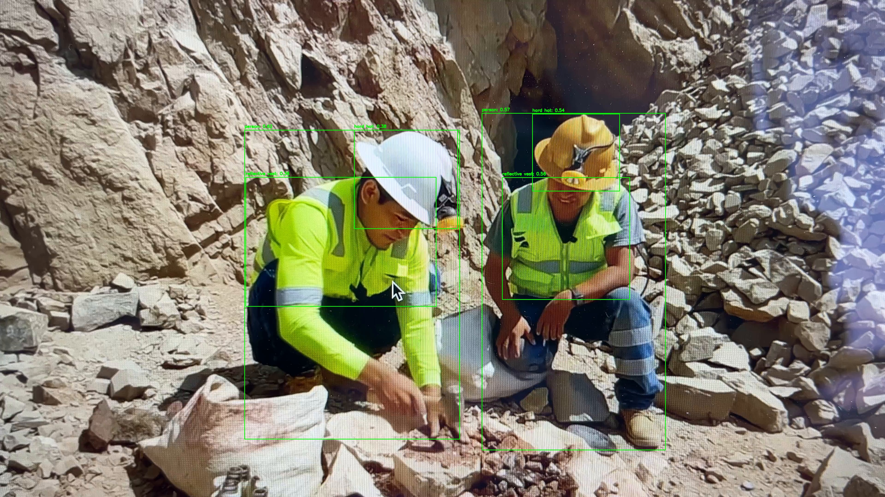

# AI Safety Monitor – PPE Detection with Grounding DINO

Prototype computer vision system for detecting Personal Protective Equipment (PPE) in industrial environments using a vision-language model.

## Overview

This project demonstrates a computer vision pipeline for detecting safety equipment such as:

- Hard hats
- Reflective safety vests
- Workers (persons)

The system processes video frames and identifies potential safety violations such as workers without helmets.

## Technologies

- Python
- OpenCV
- PyTorch
- HuggingFace Transformers
- Grounding DINO
- Vision-Language Models

## Pipeline

Video Input  
↓  
Frame Extraction  
↓  
Grounding DINO Detection  
↓  
Helmet–Person Association Logic  
↓  
Safety Rule Engine  
↓  
Annotated Video Output

## Features

- Zero-shot object detection using Grounding DINO
- PPE detection in construction environments
- Video frame processing with OpenCV
- Helmet–person spatial reasoning
- Safety alert generation

## Example Detection

## Future Improvements

- Multi-person tracking (ByteTrack)
- Vest compliance detection
- Real-time inference
- Docker deployment

## Author

Paulina Thomas  
Data Scientist | Computer Vision | AI
